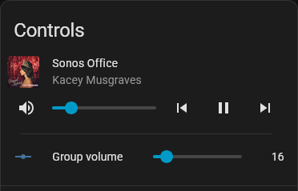

# Sonos Group Volume Controls

A custom Home Assistant integration that creates a group volume control entity for each Sonos speaker (or speaker pair) in your system.

> **Note:** This integration is a companion to Home Assistant's native Sonos integration. It does not replace or modify it; rather, it exposes the "Group Volume" (the average volume across a group) as a controllable entity, which is not currently available in the core integration.

## What it does

For every Sonos `media_player` entity in your system, this integration adds a corresponding `number` entity, neatly nested within that speaker's existing device card, as follows:

* **Grouped Speakers:** The entity displays and controls the average volume across all speakers currently in that group.
* **Ungrouped Speakers:** The entity mirrors that speaker's individual volume 1:1.
* **Proportional Scaling:** Adjusting the slider on a grouped speaker proportionally scales every member's volume up or down, preserving their relative balance.
* **Live Updates:** Entities update in real-time as speakers join/leave groups or as volume levels change (via the Sonos app, physical controls, or HA automations).
* **Display Convention:** Group volume is truncated rather than rounded to match Sonos's native display convention (e.g., 16.9% displays as 16).

## Requirements

* Home Assistant with the native **Sonos** integration configured.
* Python 3.14+

## Installation

1. In Home Assistant, navigate to **HACS** > **⋮ (three dots)** > **Custom repositories**.
2. Add [https://github.com/TheMegamind/ha-sonos-group-volume](https://github.com/TheMegamind/ha-sonos-group-volume), set the **Type** to **Integration**, and click **Add**.
3. Find **Sonos Group Volume Controls** in HACS and click **Download**.
4. Restart Home Assistant.
5. Go to **Settings** > **Devices & Services** > **Add Integration**, search for **Sonos Group Volume Controls**, and complete the setup.
   *Note: There are no configuration options; the integration automatically detects your existing Sonos speakers.*
6. A `number.<speaker>_group_volume` entity will appear under each speaker's device card.

## How it works

* **Real-time Membership:** Group membership is read directly from each player's `group_members` attribute at the time of evaluation (no caching).
* **Event-Driven:** The integration listens for state changes across all members of a group, updating the group volume entity immediately when any member's volume changes.
* **Volume Scaling:** Adjusting the group volume entity calculates a proportional scale factor from the current group average to the target value, then applies that factor to each member individually via `media_player.volume_set`.
* **Fallback Logic:** If all group members are at 0% (making the scale factor undefined), the integration defaults to setting every member directly to the target value.

## License

Distributed under the MIT License. See `LICENSE` for details.

##  Trademarks, Disclaimers and Credits

* **SONOS** name and logo are trademarks of **Sonos, Inc.**
* **Home Assistant®** name and logo are trademarks of **Nabu Casa, Inc.**
* This custom integration is **independently maintained**, and not affiliated with or endorsed by SONOS or Nabu Casa.
* This project's code and documentation have been reviewed and refined with the assistance of [Claude AI](https://claude.ai) (Anthropic). 
